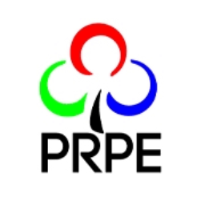

<div align="center">
  
  
  # 🏛️ Generator Documente Minorități
  
  ### Desktop application pentru generarea documentelor oficiale pentru minorități naționale
  
  
  
  
  
  
  **[📥 Download Latest Release](../../releases/latest)** • **[📖 Documentation](#-documentation)** • **[🐛 Report Issues](../../issues)**
  
</div>

---

## 🎯 Overview

**Generator Documente Minorități** este o aplicație desktop profesională dezvoltată pentru instituțiile de învățământ din România, facilitând generarea rapidă și precisă a documentelor oficiale pentru elevii din minoritățile naționale.

### ✨ Key Features

- **🖥️ Standalone Desktop App** - Nu necesită browser web sau conexiune la internet
- **📋 Document Templates** - Template-uri oficiale pentru Decizii și Referate
- **🎨 Custom Templates** - Încarcă propriile tale template-uri Word cu placeholder-uri personalizate
- **👁️ Live Preview** - Vizualizare în timp real a documentelor pe măsură ce completezi
- **🤖 Auto Placeholder Detection** - Detectează automat placeholder-urile din template-urile încărcate
- **💾 Auto-Save** - Salvare automată cu nume de fișiere cu timestamp
- **🎨 Professional Formatting** - Păstrează formatarea oficială Word (.docx)
- **🔧 Cross-Platform** - Funcționează pe Windows, macOS și Linux

## 🚀 Quick Start

### Prerequisites
- **Node.js** 18+ ([Download here](https://nodejs.org/))
- **Operating System**: Windows 10/11, macOS 10.14+, or Linux

### Installation

```bash
# Clone the repository
git clone https://github.com/andreiusq/generator-documente.git
cd generator-documente

# Install dependencies
npm install

# Start the application
npm start
```

### 📦 Build for Distribution

```bash
# Windows
npm run dist-win

# macOS  
npm run dist-mac

# Linux
npm run dist-linux
```

## 📋 Supported Document Types

### 🏛️ Decizie (Decision Document)
Template pentru aprobarea studiului în limba minorității naționale

**Required Fields:**
- Numărul deciziei
- Data deciziei  
- Numărul referatului de aprobare
- Inspector General
- Președinte comisie
- Membri comisiei
- Consilier juridic

### 📄 Referat (Report Document)  
Template pentru referatul privind învățământul în limba minorității

**Required Fields:**
- Numărul referatului
- Numele elevilor (listă)
- CNP-urile elevilor
- Clasa elevilor
- Unitatea de învățământ
- Membri comisiei

### 🎨 Custom Templates
Încarcă propriile tale template-uri Word (.docx) cu placeholder-uri personalizate

**Features:**
- **Auto-detection**: Detectează automat placeholder-urile în format `[NUME_PLACEHOLDER]`
- **Dynamic Forms**: Generează formulare automat bazate pe placeholder-uri
- **Live Preview**: Preview în timp real pentru template-urile custom
- **Template Management**: Gestionează, redenumește și șterge template-urile

**How to create custom templates:**
1. Creează documentul în Word
2. Folosește placeholder-uri în format `[NUME_PLACEHOLDER]`
3. Încarcă template-ul în aplicație
4. Aplicația detectează automat placeholder-urile și creează formularul

📖 **[Vezi ghidul complet pentru template-uri custom →](CUSTOM-TEMPLATES.md)**

## 🗂️ Project Structure

```
minoritati-generare/
├── 📁 electron/
│   ├── main.js                    # Electron main process
│   ├── document-generator.js      # Document generation logic
│   └── assets/
│       └── icon.png              # Application icon
├── 📁 templates/                  # Default Word document templates
│   ├── Model decizie.docx
│   └── model_referat_ucraineni.docx
├── 📁 custom-templates/           # User uploaded templates (auto-created)
│   └── templates.json            # Template metadata
├── 📁 generated/                  # Generated documents output
├── 📁 tests/                      # Test suite
├── index.html                     # Main application window
├── form-decizie.html             # Decision form
├── form-referat.html             # Report form
├── form-custom.html              # Dynamic custom template form
├── template-manager.html         # Custom template management
├── CUSTOM-TEMPLATES.md           # Custom templates guide
└── package.json                   # Dependencies & scripts
```

## 🛠️ Development

### Running Tests

```bash
# Run all tests
npm test

# Run tests with coverage
npm run test:coverage

# Run tests in watch mode
npm run test:watch
```

### Available Scripts

| Command | Description |
|---------|-------------|
| `npm start` | Start development server |
| `npm test` | Run test suite |
| `npm run build` | Build application |
| `npm run dist` | Create distribution package |
| `npm run electron` | Start Electron app |

## 📖 Documentation

### Template Placeholders

#### Decizie Template Placeholders:
- `[NUMAR_DECIZIE]` - Decision number
- `[DATA_DECIZIE]` - Decision date
- `[NUMAR_REFERAT_APROBARE]` - Approval report number
- `[DATA_REFERAT_APROBARE]` - Approval report date
- `[INSPECTOR_GENERAL]` - General inspector name
- `[PRESEDINTE_COMISIE]` - Commission president
- `[MEMBRI_COMISIEI]` - Commission members (numbered list)
- `[CONSILIER_JURIDIC]` - Legal advisor
- `[INTOCMIT_DE]` - Prepared by

#### Referat Template Placeholders:
- `[NUMAR_REFERAT]` - Report number
- `[DATA_REFERAT]` - Report date
- `[NUMELE_ELEVILOR]` - Students names (as table)
- `[CLASA_ELEVILOR]` - Students class
- `[UNITATEA_INVATAMANT]` - Educational institution
- `[MEMBRI_COMISIEI]` - Commission members (numbered list)
- `[APROBAT_DE]` - Approved by
- `[INTOCMIT_DE]` - Prepared by

### Configuration

Templates should be placed in the `templates/` directory:
- `Model decizie.docx` - Decision template with placeholders
- `model_referat_ucraineni.docx` - Report template with placeholders

## 🔧 Troubleshooting

### Common Issues

**Application won't start:**
```bash
# Check Node.js version
node --version

# Reinstall dependencies
rm -rf node_modules
npm install
```

**Templates not loading:**
- Ensure `.docx` files are in the `templates/` directory
- Check that templates contain correct placeholders
- Verify file permissions

**Documents not generating:**
- Check write permissions on `generated/` directory
- Ensure templates are not corrupted
- Verify all required fields are filled

## 🤝 Contributing

1. Fork the repository
2. Create your feature branch (`git checkout -b feature/AmazingFeature`)
3. Commit your changes (`git commit -m 'Add some AmazingFeature'`)
4. Push to the branch (`git push origin feature/AmazingFeature`)
5. Open a Pull Request

## 📄 License

This project is licensed under the MIT License - see the [LICENSE](LICENSE) file for details.

## 👥 Authors & Contributors

- **[Starquess România](https://starquess.ro)** - *Initial work*
- **[andreiusq](https://github.com/andreiusq)** - *Lead Developer*

## 🙏 Acknowledgments

- Dezvoltat pentru instituțiile de învățământ din România
- Suport pentru minoritățile naționale în educație
- Built with ❤️ using Electron and Node.js

---

<div align="center">
  <strong>🏛️ Generator Documente Minorități - Profesionalism în educația pentru minorități naționale</strong>
</div>